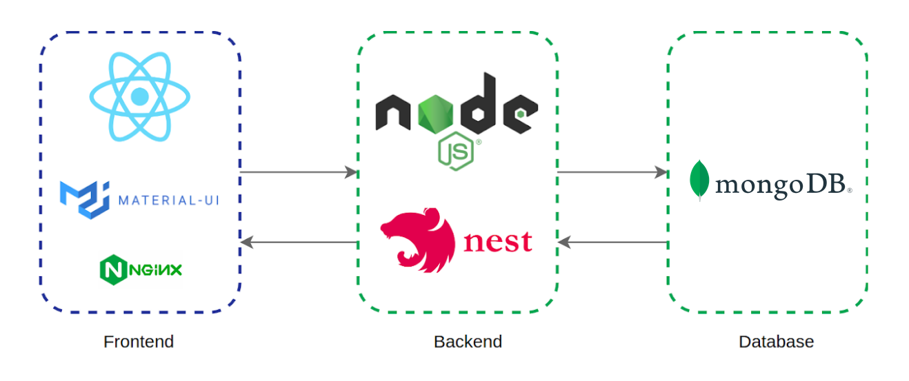

# Sudopass



## Backend

**Dependencias:**

- Node version >=16
- Mongodb

Para iniciar el backend es necesario configurar los parametros del `.env` de acuerdo al `.env.example`. Luego bastará con ejecutar.

```bash
cd sudopass-server
npm install
npm run start:dev
```

El servicio empezará a ejecutarse en `http://localhost:4200/`

## Frontend

**Dependencias:**

- Node version >=16

Para iniciar el frontend bastará con ejecutar.

```bash
cd client
npm install
npm start
```

El servicio empezará a ejecutarse en `http://localhost:3000/`
